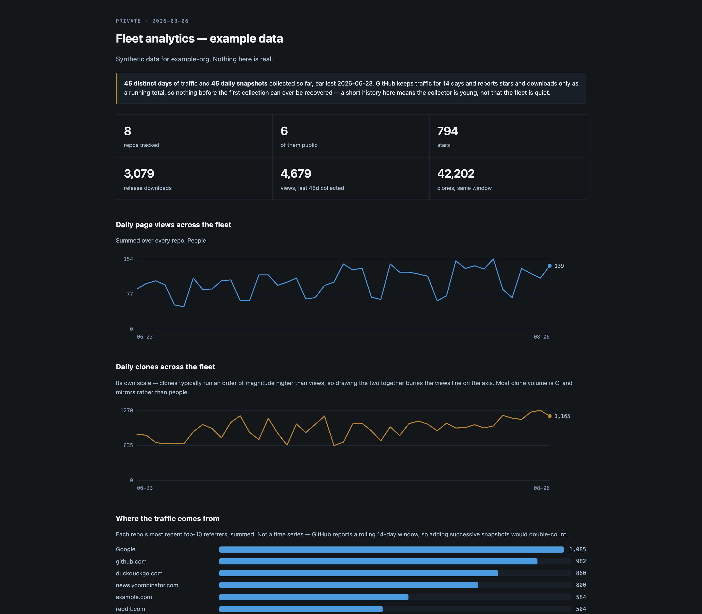

# gh-fleet-analytics user guide

**A private dashboard for every repo you own, because GitHub throws the numbers away.**

GitHub's own Insights tab shows you one repo at a time, and it forgets. **Traffic views and clones
are kept for fourteen days.** Stars, forks and release download counts are worse: the API only ever
reports the *current* total, so **a star history does not exist unless something wrote the number
down each day.**

This writes the number down each day.

> **Before you rely on this:** the collector and renderer run daily against a ~100-repo account and
> the outputs are the ones in use there. CI renders a bundled synthetic dataset on every push,
> which **proves the renderer works; it does not exercise the GitHub API.** The Worker is deployed
> and serving, but the deploy path is not covered by tests.
>
> This codebase was created with AI assistance, directed and reviewed by a human author.

---

## The one thing to understand before you start

**A day you do not collect is a day gone forever.** Not delayed — gone.

GitHub will not serve a traffic day older than 14 days, and **there is no historical endpoint for
stars or downloads at any age.** If the nightly job fails for three weeks, those three weeks are a
permanent hole, and running the collector twice afterwards will not fill it.

So: **start collecting before you think you need it, and treat a red workflow run as data loss
rather than as a flaky build.** Everything else here is recoverable.

Two consequences that show up in how it behaves:

- **Each run re-fetches the whole 14-day window and merges it over what is on disk**, newest value
  winning, rather than appending only unseen days. GitHub **revises the last day or two after the
  fact**, so "append only new dates" would freeze a half-counted day forever. Merging is also what
  makes the collector safe to run twice in a day, or after a week of downtime.
- **Traffic and snapshots are stored separately and must not be confused.** Traffic is a per-day
  measurement GitHub attributes to a date: authoritative, mergeable, **the only series that can be
  backfilled at all.** Snapshots are point-in-time totals read on the day of the run — stars,
  forks, downloads. **A gap in snapshots cannot be interpolated honestly**, so the portal
  differences consecutive snapshots and **shows a gap as a gap.**

---

## Setting it up

**1. Put it somewhere with your data.** Your collected data belongs in **your** repo, not in a
clone of this one — it is your history and it needs to be committed. Either copy the scripts in, or
keep this as a submodule and hold only your config and `data/`. **Either way, `data/` must be in a
repo you push to, because that is the history.**

**2. Configure.** Set the owner to your GitHub username or org; everything else has a working
default.

**3. Get a token — and get the scope right.**

> **Traffic endpoints require *push* access.** A read-only token returns 403 on **every single one
> of them**, which is the most common way this appears broken, and it is not documented anywhere
> obvious.

A classic token with the `repo` scope, or a fine-grained one with *Administration: read* +
*Metadata: read* applied to **all repositories**.

**No expiry, or diary the renewal** — an expired token fails silently every night.

---

## What you get

A single page, gated behind a password, covering **every repo you own — public and private, in one
table**:

- Daily views and clones across the whole account, as far back as you have collected
- Where the traffic came from, aggregated across repos
- Release download counts, ranked
- A per-repo table with 30-day sparklines, sortable by any column
- **An honest note at the top saying exactly how much history exists**

And optionally a JSON summary of your **public** repos — stars, forks, downloads, releases — to
feed a "what we've shipped" page on your own site.

**Traffic is deliberately excluded from that public file.** Views and clones say how many people
looked and did not stay, which is nobody else's business, and **a public number invites gaming.**

---

## Cost

Roughly **4 minutes of Actions time a day per hundred repos**, most of it spent **pacing rather
than working** — the search API allows 30 requests a minute, so the loop deliberately sleeps
between them. On a private repo that is about 120 minutes a month against the free allowance; on a
public repo, nothing.

A scheduled edge Worker was the obvious alternative and **does not work**: the per-invocation
subrequest limit is reached long before a hundred repos are done.

---

## Things that will bite you

- **A read-only token 403s on every traffic endpoint.** Traffic needs push access.
- **`public_repo` is not `repo`.** They are nested in GitHub's token UI and trivially confused, and
  **picking the narrow one does not produce an error** — the API answers every request cheerfully,
  just about a smaller world. **A run that quietly collects 78 of your 103 repos and reports
  success is worse than one that crashes**, because the missing repos' files are left untouched and
  simply stop updating behind a dashboard that still looks plausible. The collector compares each
  run against the previous index and **refuses to write a materially smaller one**; losing the
  private repos entirely is called out by name. `--allow-shrink` overrides it when repos really
  were deleted.
- **The org endpoint returns 404 for a personal account** and always will. The collector tries the
  authenticated-user endpoint first, then the org one, then the public one — **and prints which it
  used**, because the public fallback silently drops every private repo rather than erroring.
- **Traffic endpoints answer 202** while the day's aggregation is in flight. The collector retries,
  and the scheduled run is deliberately off the hour.
- **Two overlapping runs lose data.** Both read, both merge, and the second push wins. The workflow
  sets a concurrency group.
- **A push during collection makes the checkout stale.** Collection takes about fifteen minutes;
  anything landing on your default branch in that window makes the push fail and throws the whole
  run away. The workflow rebases and retries three times **before giving up loudly.**

---

## Trying it before you collect anything

A synthetic dataset ships with the repo, and rendering it produces exactly the screenshot above. Do
that first — it separates "the renderer works" from "my token is wrong", which is otherwise the
same blank page.
